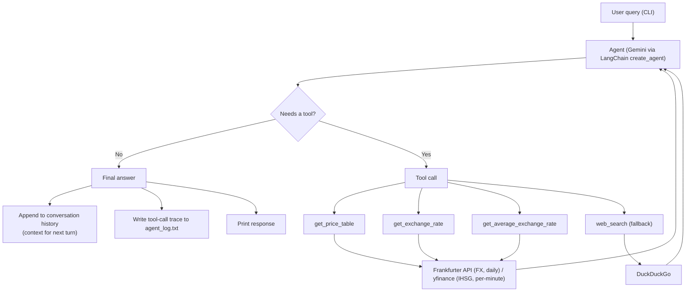

# Currency & Asset Price Agent

A terminal-based agentic assistant that answers questions about currency exchange rates and IDR-denominated asset prices (USD, SGD, TWD, gold/silver, and the IHSG index) by reasoning over which data tool to call, reconciling multiple data sources, and falling back to web search when structured data fails.

Built with **LangChain + Google Gemini**, **Frankfurter API**, and **yfinance**.

---

## Why this exists

Currency and commodity data comes from sources with genuinely different shapes: FX rates only publish daily, an equity index updates by the minute, and some assets (crypto, less common pairs) aren't covered by either. Rather than hardcoding one API call per asset, this project explores having an LLM agent decide *which* tool to call, *how* to combine results from sources with different granularities, and *when* to fall back to an unstructured search — a pattern that generalizes well beyond finance (e.g. reconciling multi-source clinical or sensor data with mismatched update frequencies).

## Features

- **Multi-asset price table** — one query returns a formatted table across several assets at once, each correctly labeled with its actual data source and update cadence
- **Cross-currency rate lookup** via EUR-pivot triangulation (Frankfurter only publishes EUR-based rates)
- **Historical averages** over a custom date range, for comparing periods
- **Automatic fallback to web search** (DuckDuckGo) when an asset isn't covered by the structured data tools
- **Conversation memory** within a session, so follow-up questions like "why did it go up?" resolve correctly to the asset just discussed
- **Full tool-call audit log** written to disk for every session, showing exactly which tool the agent picked and why

## How it works



The agent decides on its own whether a question needs one tool call, several, or none — the loop above repeats until it has enough information to answer.

## Tech stack

| Layer | Choice | Why |
|---|---|---|
| LLM / agent loop | Google Gemini via `langchain.agents.create_agent` | Free tier, native tool-calling |
| FX & metals data | Frankfurter API v2 | Free, no key, but EUR-based and daily-only — required explicit pivot logic |
| Equity index data | yfinance (`^JKSE`) | Only source with true intraday granularity |
| Fallback search | DuckDuckGo (`ddgs`) | Catches assets outside the two structured sources (e.g. crypto) |
| Config | `.env` / `python-dotenv` | Keeps the API key out of source control |

## Example session

```
Anda: update harga hari ini

Agent:
| Aset | Harga | Perubahan (vs hari sebelumnya) | Update Terakhir |
|---|---|---|---|
| USD | Rp15,890.00 | 🔺 +0.12% | 2026-09-15 • dicek 09:41 |
| SGD | Rp12,340.50 | 🔻 -0.05% | 2026-09-15 • dicek 09:41 |
| TWD | Rp553.20 | 🔺 +0.18% | 2026-09-15 • dicek 09:41 |
| Emas (XAU) | $2,610.40/oz | Rp1,310,450/gr (Rp13,105/0.01gr) | 🔺 +0.31% | 2026-09-15 • dicek 09:41 |
| IHSG | Rp7,412.88 | 🔻 -0.22% | 2026-09-15 09:38 |

Anda: kenapa TWD naik?

Agent: Berdasarkan pencarian web, penguatan TWD hari ini terkait permintaan
ekspor semikonduktor yang kuat dari Taiwan...
```
*(illustrative transcript — actual figures will differ per run)*

Each session's full tool-call trace (which tool ran, its arguments, and its raw result) is written to `agent_log.txt` for debugging and transparency.

## Setup

```bash
# 1. Clone and install
pip install -r requirements.txt   # langchain-google-genai, requests, yfinance, ddgs, python-dotenv

# 2. Configure
cp .env.example .env
# add your GOOGLE_API_KEY (free from Google AI Studio)

# 3. Run
python currency_agent.py
```

Type `reset` to clear conversation context, or press **Esc** (Windows) / `Ctrl+C` (other OS) to quit.

## Known limitations

- `agent_log.txt` is overwritten each new session (not appended across runs) — fine for debugging a single session, not for long-term history
- No automated tests yet
- A companion price-alert tool for TWD/IDR was prototyped but not kept — the daily-granularity data source wasn't a good fit for a threshold alert use case
- Currently local-only; not yet packaged as an installable CLI

## Roadmap ideas

- Persist logs per session (timestamped files) instead of overwriting
- Add basic unit tests for the EUR-pivot triangulation logic
- Package as a proper CLI (`pipx install`) instead of running the script directly